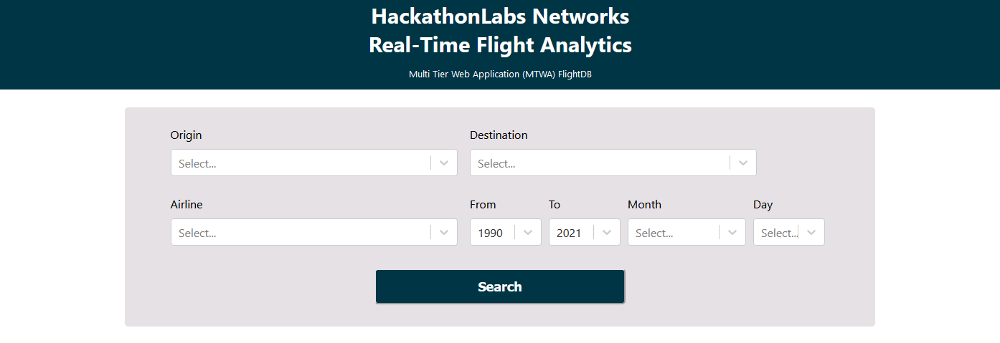
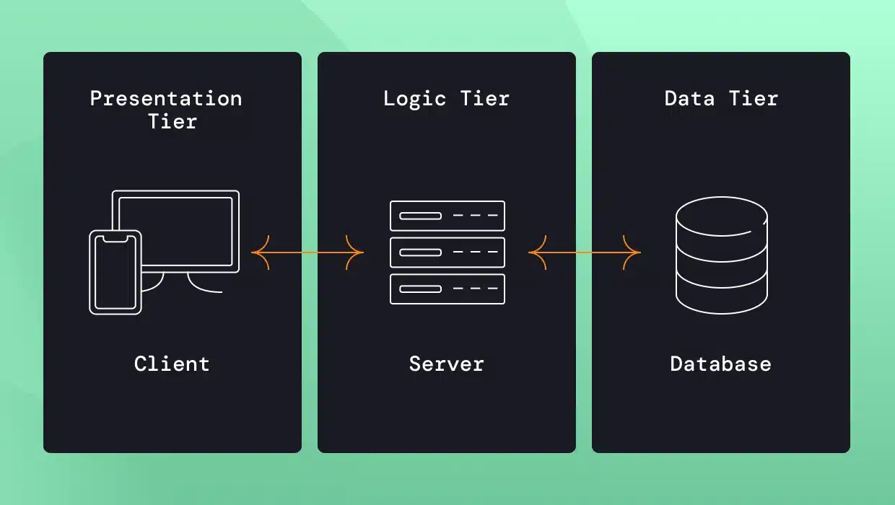
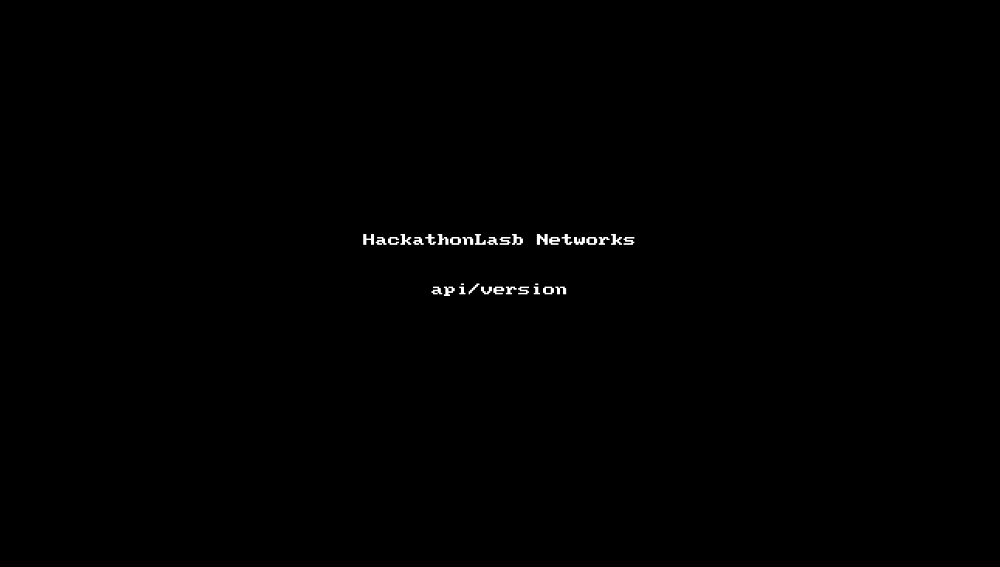
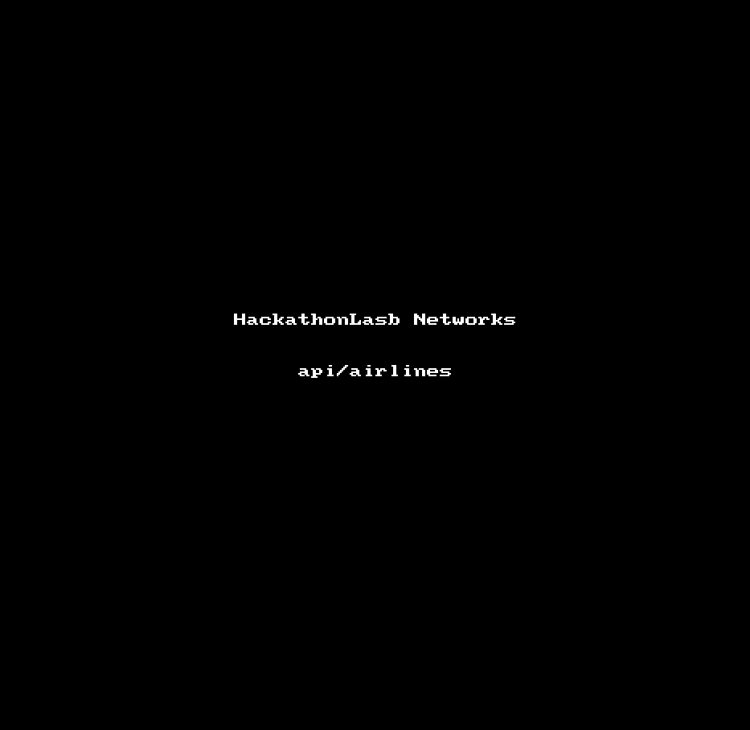
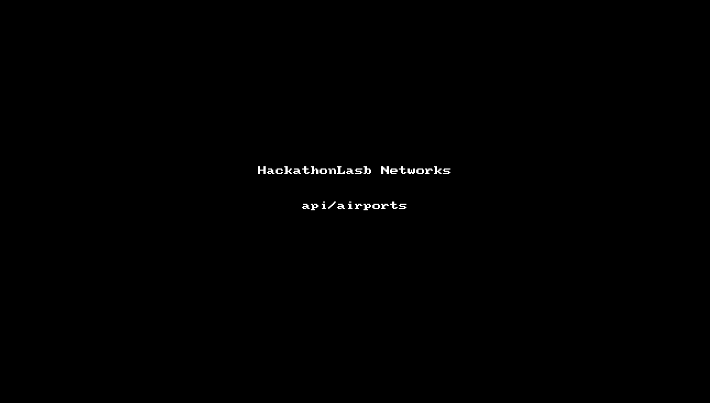
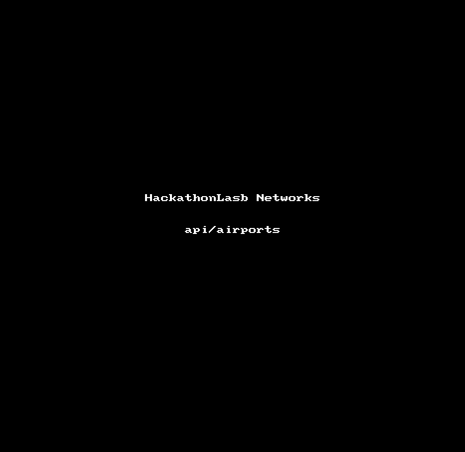

# Multi Tier Web Application (MTWA) FlightDB

<p align="center">
  
</p>

## Declaración de exención de responsabilidad

Esta es una obra de ficción. Los nombres, personajes, lugares y sucesos son producto de la imaginación de los autores o utilizados de manera ficticia. Cualquier parecido con personas reales, vivas o muertas, es mera coincidencia.

## Introducción

Su segundo desafío del día, será implementar una solución innovadora y robusta para gestionar datos de vuelos a través de la aplicación ***Multi Tier Web Application (MTWA) FlightDB***. Este reto requiere una combinación de habilidades técnicas, creatividad y capacidad para resolver distintos problemas, en un entorno de trabajo colaborativo y dinámico.

## Contexto del desafío

El creciente volumen de datos en la industria de la aviación comercial, representa un reto significativo en términos de gestión y accesibilidad de la información. ***MTWA FlightDB*** es una iniciativa creada para lidear con esta situación, la cual proporciona una plataforma centralizada que facilita el acceso, la gestión y el análisis de datos de vuelos. Por lo que ustedes deberán desplegar esta solución basado en los lineamientos que a continuación se irán detallando.

## Objetivos del proyecto

Los equipos deben centrarse en varios aspectos clave para completar con éxito este desafío:

1. ***Infraestructura del sistema***: Implementar una infraestructura sólida que soporte los servicios de backend y frontend, garantizando la disponibilidad y rendimiento óptimo.
2. ***Gestión de datos***: Configurar una base de datos eficiente y segura para almacenar grandes volúmenes de información de vuelos, permitiendo una fácil recuperación y manipulación de datos.
3. ***Interfaz de usuario***: Asegurar que la interfaz de usuario permita a los usuarios finales interactuar con los datos de manera eficaz, facilitando la visualización y el análisis de la información.
4. ***Seguridad y cumplimiento***: Asegurar que todos los componentes del sistema cumplan con los estándares de seguridad y regulaciones relevantes, protegiendo los datos sensibles y manteniendo la integridad del sistema.

## Prólogo

El equipo técnico de ***HackathonLabs Networks*** les ha asignado a ***ustedes cuatro*** ahora como ***administradores de sistemas*** la misión de implementar un proyecto de la Autoridad de Aviación Civil de Panamá.

La Organización de Aviación Civil Internacional (OACI) le ha solicitado a todos los gobiernos hacer pública en internet la información de los vuelos históricos por cumplimiento.

El equipo de tecnología `Sicherheit7` de ***HackathonLabs Networks*** les ha entregado un documento que contiene el nombre de su equipo, al cual se le ha asignado un nombre código de tres letras, así como un número de equipo de tres dígitos y el código del reto. Esta información deberá ser utilizada durante el desarrollo del desafío. A continuación, les presentamos un ejemplo del documento.

e.g.:

```bash
TEAM_NAME   = "Adaptive Firewall Mechanics"
TEAM_CODE   = "AFM"
TEAM_NUMBER = "015"
RETO        = "reto12"
CODE_NAME   = "${TEAM_CODE}${TEAM_NUMBER}"
```

***HackathonLabs Networks*** y su equipo de programadores `Atenea01` desarrollaron la aplicación ***MTWA FlightDB*** para cumplir con los requerimientos de la OACI. El código fuente de dicha aplicación está alojado en el repositorio de GitHub [https://github.com/HackathonLabsNetworks/2024-reto-02.git](https://github.com/HackathonLabsNetworks/2024-reto-02.git).

Ustedes han tenido reuniones con el equipo `Atenea01` para entender la arquitectura de la aplicación ***MTWA FlightDB***. El equipo `Atenea01` les explica que ***MTWA FlightDB*** está construida con una arquitectura de ***tres capas***.

<p align="center">
  
</p>

El equipo `Atenea01` también indica que en dicho repositorio se encuentran tres carpetas para cada capa, las cuales son: `db` para la capa de datos, `api` para la capa de lógica de negocio y `client` para la capa de presentación.

La capa de datos es un sistema de gestión de bases de datos relacionales (RDBMS, por sus siglas en inglés) que usa `MariaDB` como base de datos ya que cumple con los requerimientos de un motor de almacenamiento columnar que utiliza una arquitectura distribuida de datos paralela; `MariaDB ColumnStore` tiene CMAPI, el cual es una API REST para administrar MariaDB Enterprise ColumnStore en topologías multinodo.

En cuanto a la capa de lógica del negocio, se decidió utilizar `Python` versión `3.12` como lenguaje de programación. Y por último, la capa de presentación se desarrolló en `React` y `Node.js` versión `20`.

La arquitectura tecnológica necesaria para poder desplegar la aplicación ***MTWA FlightDB*** la diseñó el equipo `Nephós9` y consta de:

- Un diagrama de arquitectura. [infraestructure_diagram.png](imgs/reto_12_v6_w_fgt.png)

<p align="center">
  
</p>

- Un archivo de texto con la información de los DNS.

```bash
# DNS Externos
    hello.${CODE_NAME}.reto12.copa.hackathonlabs.net
     uuid.${CODE_NAME}.reto12.copa.hackathonlabs.net
  bastion.${CODE_NAME}.reto12.copa.hackathonlabs.net
fortigate.${CODE_NAME}.reto12.copa.hackathonlabs.net
      www.${CODE_NAME}.reto12.copa.hackathonlabs.net
# DNS Internos
    hello.${CODE_NAME}.reto12.copa.hackathonlabs.local
     uuid.${CODE_NAME}.reto12.copa.hackathonlabs.local
  bastion.${CODE_NAME}.reto12.copa.hackathonlabs.local
fortigate.${CODE_NAME}.reto12.copa.hackathonlabs.local
      www.${CODE_NAME}.reto12.copa.hackathonlabs.local
      web.${CODE_NAME}.reto12.copa.hackathonlabs.local
      api.${CODE_NAME}.reto12.copa.hackathonlabs.local
       db.${CODE_NAME}.reto12.copa.hackathonlabs.local
```

- Un archivo que contiene tablas con la información del IP PLAN.

|VNET No.|VNET Name|
|:---:|---|
|`${TEAM_NUMBER}`|reto12-`${CODE_NAME}`-az-rg001-vnet`${TEAM_NUMBER}`-prod-eastus-prod|

|VNET No.|SUBNET No.|SUBNET name|
|:---:|:---:|---|
|`${TEAM_NUMBER}`|001|reto12-`${CODE_NAME}`-az-rg001-vnet`${TEAM_NUMBER}`-snet001-bastion-eastus-prod    |
|`${TEAM_NUMBER}`|002|reto12-`${CODE_NAME}`-az-rg001-vnet`${TEAM_NUMBER}`-snet002-fgt_outisde-eastus-prod|
|`${TEAM_NUMBER}`|003|reto12-`${CODE_NAME}`-az-rg001-vnet`${TEAM_NUMBER}`-snet003-fgt_inside-eastus-prod |
|`${TEAM_NUMBER}`|004|reto12-`${CODE_NAME}`-az-rg001-vnet`${TEAM_NUMBER}`-snet004-dmz-eastus-prod        |
|`${TEAM_NUMBER}`|005|reto12-`${CODE_NAME}`-az-rg001-vnet`${TEAM_NUMBER}`-snet005-servers-eastus-prod    |

|VNET No.|Address Space|SUBNET No.|SUBNET CIDR|
|:---:|---|:---:|---|
|`${TEAM_NUMBER}`|10.15.`${TEAM_NUMBER}`.0/24|001|10.15.`${TEAM_NUMBER}`.0/27|
|`${TEAM_NUMBER}`|10.15.`${TEAM_NUMBER}`.0/24|002|10.15.`${TEAM_NUMBER}`.32/27|
|`${TEAM_NUMBER}`|10.15.`${TEAM_NUMBER}`.0/24|003|10.15.`${TEAM_NUMBER}`.64/27|
|`${TEAM_NUMBER}`|10.15.`${TEAM_NUMBER}`.0/24|004|10.15.`${TEAM_NUMBER}`.96/27|
|`${TEAM_NUMBER}`|10.15.`${TEAM_NUMBER}`.0/24|005|10.15.`${TEAM_NUMBER}`.128/27|

El equipo `Nephós9` desplegó hace unos días a través de `Terraform` (*IaC*) tres servidores para la aplicación, un firewall para proteger la aplicación y un bastión para administrar los servidores en `Microsoft Azure`.

`Nephós9` les indica que solo podrán acceder a los servidores a través del `bastion` y que su DNS está en el adjunto. De igual manera, se tomaron las debidas consideraciones para proteger los servidores a través de un firewall `Fortigate` al cual podrán acceder a su IP de administración vía el DNS descrito en el adjunto.

Importante, el `Fortigate` se utiliza tanto para proteger a los servidores de la aplicación ***MTWA FlightDB***, como para inspeccionar el tráfico saliente de acceso a internet (*North-South*), así como crear micro-segmentación (*East-West*) entre los servidores de FrontEnd (WEB) y BackEnd (API, DB) y por último, poder publicar la aplicación ***MTWA FlightDB*** vía ***HTTP*** a internet.

De igual manera se crearon dos zonas de DNS, una pública `hackathonlabs.net` y otra privada `hackathonlabs.local`.

## Asignaciones

***HackathonLabs Networks*** les ha dado una ventana de mantenimiento de **dos horas** para llevar a cabo el trabajo de instalación y configuración de la aplicación ***MTWA FlightDB***.

Para administrar la infraestructura desplegada en `Microsoft Azure`, deberán conectarse al servidor de bastión vía protocolo `SSH` o `RDP` mediante el DNS `bastion.${CODE_NAME}.reto12.copa.hacktonlabs.net`. En este bastión, ***HackathonLabs Networks*** les ha habilitado las herramientas necesarias para gestionar el despliegue de la aplicación ***MTWA FlightDB***.

> [!WARNING]
> Tengan en cuenta que el servidor de `bastion` tiene recursos limitados. Ustedes podrán acceder al mismo tiempo vía `RDP`. Se recomienda usar `SSH` al `bastion` y luego `SSH` a los servidores de la aplicación ***MTWA FlightDB***.

Su equipo deberá entrar a cada servidor e instalar su respectivo componente de la aplicación ***MTWA FlightDB***.

Lo primero que requiere cada servidor es establecer su `hostname` correspondiente, e.g.: `web.${CODE_NAME}.reto12.copa.hackathonlabs.local` y actualizar todos los paquetes del sistema operativo a la última versión. En cada servidor van a requerir las herramientas de git, wget y el editor de texto preferido.

Todos los servidores, por motivos de cumplimiento, deben tener instalado y activo **Cockpit** para su administración y monitoreo por parte del equipo `Netzwerkbetriebszentrum` de ***HackathonLabs Networks***.

### Firewall Fortigate

Los objetivos para la protección perimetral de la infraestructura que alberga el workload ***MTWA FlightDB*** son:

1. Todos los servidores tendrán acceso a internet solamente a través de los protocolos `http`, `https` y `dns`.
2. La microsegmentación `East-West` solo permitirá accesos de la red FrontEnd (FE) a la red BackEnd (BE).
3. El único servidor que se publicará hacia internet será el servidor web cliente, el cual tendrá una IP pública distinta de la que se usa para navegar por internet, y los protocolos permitidos serán solamente `http` y `https`.

El `Fortigate` se encuentra precargado con la configuración mínima de enrutamiento hacia el Address Space y la política de acceso a internet, que solo permite `http`, `https` `dns`. También será imperativo instalar la licencia, ya que de otro modo la configuración mínima no funcionará y no se podrán actualizar ni descargar los paquetes necesarios para trabajar y desplegar la aplicación en los servidores. Ambas redes, tanto la DMZ como la red de los servidores de producción, están protegidas por el `Fortigate`.

> [!CAUTION]
> Si la creación y activación de la licencia en el Fortigate se realizó anteriormente de forma exitosa, no será necesario crear una cuenta en [https://support.fortinet.com/](https://support.fortinet.com/) ni reactivar el `Fortigate`.

Lo primero que deben hacer, es crear una cuenta en el sitio de soporte de `Fortinet` [https://support.fortinet.com/](https://support.fortinet.com/) para poder licenciar el firewall `Fortigate`, ya sea entrando vía web o SSH a través de la interfaz de Out of Band Management (OOBM), la cual tiene el DNS configurado como `fortigate.${CODE_NAME}.reto12.copa.hacktonlabs.net`. El firewall se puede administrar desde el `bastion` vía web o SSH con el DNS `fortigate.${CODE_NAME}.reto12.copa.hacktonlabs.local`. Para licenciar el `Fortigate`, se recomienda buscar la documentación oficial de `Fortinet` sobre "Permanent trial mode for FortiGate-VM" en [https://docs.fortinet.com/](https://docs.fortinet.com/). 

> [!CAUTION]
> Se les recuerda que si tienen una cuenta previa creada o licencia, deben eliminarla ya que su cuenta solo permitirá la creación de una sola licencia y no más. Esta licencia es del tipo `Permanent trial mode`y solo les permitirá configurar 3 rutas estáticas y 3 políticas. Recuerden que todas las reglas configuradas en el `Fortigate` deben estar definidas con `Addresses` y no con segmentos o IPs.

Una vez que el `Fortigate` esté licenciado y puedan acceder vía web o SSH, encontrarán preconfigurado el enrutamiento en el `Fortigate` para que funcione con la red de `Microsoft Azure`, la cual está definida con el destino del `address space` y la interfaz de salida interna (`inside`) apuntando al gateway, que corresponde a la primera IP de la subred `003`.

La política de acceso a internet debe tener el flujo de tráfico de la interfaz interna (`inside`) a la interfaz externa (`outside`), además de quedar explícito que la única red interna definida es la supernet o `address space` y la red externa debe ser `0/0`.

Para que los servidores de la red DMZ tengan acceso a la red de servidores de producción es necesario configurar la política East-West, la cual debe tener el flujo de tráfico de la interfaz interna (`inside`) a la interfaz interna (`inside`), además de quedar explícito como origen la subred `004` y como destino la red `005`.

Por último, para la publicación del servidor `FrontEnd (FE)`, hay que realizar tres distintas configuraciones:

1. Crear una IP secundaria en la interfaz externa (`outside`) con la IP que sigue a la configurada actualmente en la interfaz externa (`outside`), que es la séptima IP de la subred `002`.
2. Crear y configurar un Virtual IP (VIP) definiendo el external address con la IP secundaria de la interfaz `outside` y el mapped address con la IP del servidor web.
3. Crear una política para permitir la comunicación inbound con flujo de tráfico de la interfaz externa (`outside`) a la interfaz interna (`inside`) con origen `0/0` y destino el VIP creado, permitiendo solamente los protocolos `http` y `https`.

Se sugiere revisar y seguir la documentación oficial de `Fortinet` sobre "Fortigate Azure Using public IP addresses" en [https://docs.fortinet.com/](https://docs.fortinet.com/) para poder configurar la publicación del `FE`.

#### TL;DR Firewall

- Instalar la licencia en modo de prueba permanente.
- Configurar las direcciones (Addresses) para usar en las políticas.
- Configurar las rutas estáticas.
- Configurar la IP secundaria para la publicación del FE.
- Configurar la dirección VIP para la publicación del FE.
- Configurar las políticas del firewall:
  1. Acceso a Internet (Outbound).
  2. Acceso East-West.
  3. Acceso para la publicación del FE (Inbound).

### Servidor de Base de Datos

Descarguen el repositorio donde se aloja el código de la aplicación ***MTWA FlightDB***. Con la información de este repositorio tendrán la data necesaria para la base de datos a excepción de `flights.csv`, la cual podrán obtener ya sea descargándola de internet mediante el shell script `get_flight_data.sh`, o el equipo `Nephós9` gentilmente durante el despliegue automatizado de la infraestructura de ***Microsoft Azure*** les depositó dicho archivo en el bastión en la ruta `/mnt/sdc1/db_data/`, pudiendo copiar de forma más rápida este archivo del servidor bastión a otro servidor.

> [!TIP]
> Podrán validar el contenido de los archivos mediante el hash **MD5** o **SHA** del archivo.  
> 
> **md5sums**  
> `3e1a18dfd5e23779086a9de13ce38e9d` data/airlines.csv  
> `bf1bac9d01545fbbfc940b0f6e4d08ba` data/airports.csv  
> `2fc9be2f82a490d93cf2e19cd3263851` data/flights.csv  
> 
> **sha256sums**  
> `3ef3184f241e19a0209600846eb7158fe5f0f5d2ff010b329e422cf5a025d7fa` data/airlines.csv  
> `3f862d083bd0124de9c9e55456753fc3ecc1b9cd7305d860d16f8acfc6fe2672` data/airports.csv  
> `d1b522d256a20875f773527c1fae57fcfcbd004317ef8345006004ce453d2ca4` data/flights.csv  

Ahora bien, tienen que instalar la base de datos usando el repositorio de paquetes oficiales de `mariadb.com`, tanto el motor de base de datos como el motor de `ColumnStore` y su `CMAPI`.

Utilicen la aplicación `mariadb-secure-installation` para realizar hardening del motor de base de datos utilizando los siguientes parámetros:

- Cambien la contraseña de root a `masteradmin1`.
- Eliminen el usuario anonymous.
- Deshabiliten el acceso remoto del usuario root.
- Remuevan la base de datos `test` y sus accesos.
- Recarguen las tablas de privilegios.

Una vez instalada la aplicación de base de datos, deberán crear la misma usando el `schema.sql` y una vez obtenida toda la información con los tres archivos `airlines.csv`, `airports.csv` y `flights.csv` (data cruda en texto plano ubicada en `db/data/`) deberá correr el shell script `load.sh` para cargar toda esta data en la base de datos.

> [!WARNING]
> Debido a la cantidad de datos en el archivo `flights.csv`, el shell script `load.sh` puede tomar unos 10~15 minutos.

Posteriormente creen un usuario `user1` con autenticación `password1` y asignen los permisos necesarios para que dicho usuario tenga todos los privilegios sobre la base de datos `travel`, también permitan que el usuario `user1` pueda conectarse remotamente desde los servidores `bastion.${CODE_NAME}.reto12.copa.hackathonlabs.local` y `api.${CODE_NAME}.reto12.copa.hackathonlabs.local` con todos los privilegios sobre la base de datos `travel`.

Al configurar los accesos remotos de `MariaDB` a través de nombres DNS, utiliza `bastion.${CODE_NAME}.reto12.copa.hackathonlabs.local` y `bastion.internal.cloudapp.net`, así como también `api.${CODE_NAME}.reto12.copa.hackathonlabs.local` y `api.internal.cloudapp.net`. Es necesario configurar correctamente el nombre de host del sistema operativo, ya que `MariaDB` validará el nombre DNS que la plataforma de nube de Azure utilice en la llamada, garantizando así la conexión.

El firewall del sistema operativo no tiene el puerto nativo de `MySQL` abierto, por lo que será necesario configurar `firewalld` para que permita `TCP` del puerto nativo de `MySQL`.

Una vez hecho todo lo anterior, desde el servidor de `bastion` tendrán que probar la conexión remota vía CLI a la base de datos mediante el comando `mariadb --host ${DB_SERVER_HOSTNAME} --port ${MYSQL_PORT} --user user1 -ppassword1`

#### TL;DR DB Server

- Configurar el nombre del host.
- Actualizar el servidor.
- Clonar el repositorio.
- Descargar los datos de la base de datos.
- Validar el contenido de los datos.
- Instalar el repositorio oficial de MariaDB.
- Instalar el motor de base de datos, ColumnStore y CMAPI.
- Iniciar el servicio de base de datos.
- Realizar el hardening de la aplicación de base de datos.
- Crear la base de datos.
- Cargar los datos en la base de datos.
- Crear los permisos de acceso remoto en el motor de base de datos.
- Configurar el firewall del sistema operativo para permitir la conexión remota a la base de datos.
- Probar la conexión remota a la base de datos desde el bastión.

### Servidor de API

Para probar que el servidor de API tenga conexión exitosa al servidor de base de datos, deberán instalar el cliente de MariaDB y probar la conexión remota vía CLI a la base de datos mediante el comando `mariadb --host ${DB_SERVER_HOSTNAME} --port ${MYSQL_PORT} --user user1 -ppassword1`

Descarguen el repositorio donde se aloja el código de la aplicación **MTWA FlightDB**. Como estándar de cumplimiento y de acuerdo a las políticas de **HackathonLabs Networks**, toda aplicación se debe instalar en la ruta `/opt/`. El código `api` de `Python` debe ser instalado en `/opt/traveldb-api`.

La versión de `Python` soportada es la `3.12`. Los paquetes que utiliza el código siempre son listados en el archivo `requirements.txt`.

De acuerdo a los estándares empresariales de **HackathonLabs Networks** es requerido que toda aplicación instalada en Linux deba correr como **demonio de forma desatendida**, por lo que deberán crear un servicio de `systemd` llamado `traveldb-api.service` para la ejecución del código de `Python`.

Las publicaciones de las APIs se realizan en el puerto `8080` en el servidor, pero debido a políticas de seguridad, la publicación tendrá que ser a través del puerto `tcp/80` protocolo `http` usando un `reverse proxy` configurado con `Apache`. Por lo que deberán configurar el booleano de SELinux que evita que los scripts y módulos HTTP inicien una conexión a una red o puerto remoto (habiliten el booleano `httpd_can_network_connect` para permitir este acceso).

El archivo de configuración de `Apache` para el `reverse proxy` debe llevar el nombre de `traveldb-api.conf`, para documentarlo en la hoja de vida del servidor y poder darle soporte al mismo.

El firewall del sistema operativo no tiene el puerto nativo de `http` abierto, por lo que será necesario configurar `firewalld` para que permita `TCP` del puerto nativo de `http`.

Una vez hecho todo lo anterior, desde el servidor de `bastion` podrán probar la conexión remota vía CLI a los APIs mediante los siguientes comandos:

- API versión: `curl http://api.${CODE_NAME}.reto12.copa.hackathonlabs.local/api/version`
- API Airlines: `curl http://api.${CODE_NAME}.reto12.copa.hackathonlabs.local/api/airlines`
- API Airports: `curl http://api.${CODE_NAME}.reto12.copa.hackathonlabs.local/api/airports`

También desde el `bastion`, usando el navegador web `Firefox`, podrán abrir las URLs mencionadas arriba.

#### TL;DR API server

- Configurar el nombre del host.
- Actualizar el servidor.
- Clonar el repositorio.
- Instalar el cliente de base de datos (OPCIONAL).
- Instalar Python.
- Instalar el código de las APIs en la ruta designada.
- Crear el demonio para ejecutar los servicios sin supervisión (modo desatendido).
- Iniciar el demonio.
- Instalar Apache.
- Configurar SELinux.
- Configurar Apache para publicar las APIs.
- Configurar el firewall del sistema operativo para permitir la conexión remota a las APIs.
- Probar la conexión remota a las APIs desde el bastión.

#### e.g: API server

##### api/version

###### bash api/version

<p align="center">
  
</p>

###### Firefox api/version

<p align="center">
  
</p>

##### api/airlines

###### bash api/airlines

<p align="center">
  
</p>

###### Firefox api/airlines

<p align="center">
  
</p>

##### api/airports

###### bash api/airports

<p align="center">
  
</p>

###### Firefox api/airports

<p align="center">
  
</p>

### Servidor cliente web

Para verificar que el servidor web tiene una conexión exitosa al servidor de APIs, prueben la conexión remota desde el servidor web mediante CLI con el comando `curl http://${URI}`.

Descarguen el repositorio donde se aloja el código de la aplicación **MTWA FlightDB**. De acuerdo con las políticas de **HackathonLabs Networks**, todas las aplicaciones deben instalarse en la ruta `/opt/`. El código `client` de `NodeJS React` debe ser instalado en `/opt/traveldb-web`.

La versión de `NodeJS` soportada es la `20`. De igual manera deben usar `npm` para realizar la instalación del código fuente mediante `npm install` y para correr la aplicación deberá usar `npm start`.

También deberán configurar el archivo `package.json` y reemplazar el proxy de `localhost` con la URL del servidor API, permitiendo que el cliente web pueda hacer CORS hacia los APIs.

La aplicación que se instalará debe ejecutarse como demonio de forma desatendida, a través de un servicio de `systemd` llamado `traveldb-web.service` para la ejecución del código de `npm`.

De igual manera deberán configurar el booleano de SELinux `httpd_can_network_connect` para permitir dicho acceso.

El archivo de configuración de `Apache` para el `reverse proxy` deberá llamarse `traveldb-web.conf`, para documentarlo y poder dar soporte.

El firewall del sistema operativo no tiene el puerto nativo de `http` y `https` abierto, por lo que será necesario configurar `firewalld` para permitir `TCP` en el puerto nativo de `http` y `https`.

Después de haber completado la interesante tarea de desplegar y configurar la aplicación **MTWA FlightDB**, tendrán que probar la aplicación creada por **HackathonLabs Networks** dentro de la intranet a través del `bastion` desde el navegador `Firefox` con el URL `www.${CODE_NAME}.reto12.copa.hackathonlabs.local`.

En cumplimiento con los requisitos de seguridad, la aplicación **MTWA FlightDB** deberá estar publicada de forma segura mediante el protocolo `https`, utilizando `certificados SSL/TLS` de ***Let's Encrypt***. Para ello, deberán instalar `certbot` via `snapd` y configurarlo para usar el desafío `dns-01` mediante el plugin `certbot-dns-azure`. Además, deberán configurar `Apache` para que utilice el `módulo SSL` y los `certificados SSL/TLS` obtenidos a través de `certbot`.

Como última tarea, tendrán que publicar la aplicación en internet para poder cumplir con las regulaciones de la OACI y del gobierno Panameño. Por lo tanto, deberán acceder a la página `www.${CODE_NAME}.reto12.copa.hackathonlabs.net` desde una computadora o dispositivo móvil utilizando la **red provista por eel hackathonCopa**.

#### TL;DR Web server

- Configurar el nombre del host.
- Actualizar el servidor.
- Clonar el repositorio.
- Instalar NodeJS.
- Instalar el código del cliente web en la ruta designada.
- Modificar el código de NodeJS.
- Crear el demonio para ejecutar los servicios sin supervisión (modo desatentido).
- Iniciar el demonio.
- Instalar Apache.
- Configurar SELinux.
- Configurar Apache para publicar las APIs.
- Configurar el firewall del sistema operativo para permitir la conexión remota al cliente web.
- Probar la conexión remota al cliente web desde el bastión.
- Instalar `certbot`.
- Obtener certificados SSL/TLS de ***Let's Encrypt*** mediante el desafío DNS de Azure.
- Configurar `Apache` con los certificados SSL/TLS para publicar las APIs de forma segura.

### Registros DNS

El equipo `Sicherheit7` solicitó al equipo de `Nephós9` crear unas `llaves uuid` y registrarlas en DNS. Ustedes tendrán que validar el contenido de las `llaves uuid`. Los registros son los siguientes:

```bash
uuid.${CODE_NAME}.reto12.copa.hackathonlabs.net
uuid.${CODE_NAME}.reto12.copa.hackathonlabs.local
```

## Criterios de evaluación

<!-- Los criterios de evaluación están deliberadamente desordenados. -->

### 1. Instalación y configuración de MariaDB

**Objetivo:** Evaluar la capacidad del equipo para instalar y configurar MariaDB correctamente.

**Puntos a evaluar:**

- **Instalación:** Verificar que MariaDB se haya instalado correctamente.
- **Seguridad:** Comprobar la implementación de medidas de seguridad, como la configuración de contraseñas seguras para el usuario root y la eliminación de usuarios anónimos.
- **Configuración inicial:** Revisar la creación y configuración de bases de datos y usuarios necesarios para la aplicación.
- **Pruebas:** Confirmar que la base de datos esté operativa y accesible desde la aplicación.

### 2. Instalación de la aplicación como demonio

**Objetivo:** Evaluar la capacidad del equipo para instalar la aplicación y configurarla como un demonio del sistema.

**Puntos a evaluar:**

- **Instalación:** Verificar que la aplicación se haya instalado correctamente.
- **Configuración del demonio:** Comprobar que la aplicación se haya configurado para ejecutarse como un servicio del sistema (demonio), incluyendo la creación del archivo de unidad en systemd o script de inicio.
- **Arranque automático:** Revisar que el servicio se inicie automáticamente al arrancar el sistema.
- **Pruebas:** Confirmar que la aplicación esté operativa y funcione como se espera.

### 3. Configuración de Apache

**Objetivo:** Evaluar la capacidad del equipo para configurar Apache para servir la aplicación.

**Puntos a evaluar:**

- **Instalación de Apache:** Verificar que Apache se haya instalado correctamente.
- **Configuración de Virtual Hosts:** Comprobar la configuración de virtual hosts para la aplicación.
- **Seguridad:** Revisar la implementación de medidas de seguridad como HTTPS, certificados SSL y configuración de firewalls.
- **Pruebas:** Confirmar que la aplicación sea accesible a través del navegador.

### 4. Configuración del Firewall

**Objetivo:** Evaluar la capacidad del equipo para configurar el firewall y asegurar que la aplicación sea accesible.

**Puntos a evaluar:**

- **Instalación y configuración:** Verificar que el firewall esté instalado y configurado correctamente.
- **Reglas de firewall:** Comprobar la creación de reglas específicas para permitir el tráfico hacia la aplicación y servicios necesarios (puertos HTTP/HTTPS, etc.).
- **Seguridad:** Revisar la implementación de políticas de seguridad para minimizar vulnerabilidades.
- **Pruebas:** Confirmar que la aplicación sea accesible y que el firewall esté funcionando correctamente.

### 5. Instalación de Cockpit

**Objetivo:** Evaluar la capacidad del equipo para instalar y configurar Cockpit para la gestión del servidor.

**Puntos a evaluar:**

- **Instalación:** Verificar que Cockpit se haya instalado correctamente.
- **Acceso:** Comprobar que Cockpit sea accesible a través de un navegador web.
- **Pruebas:** Confirmar que todas las funcionalidades principales de Cockpit estén operativas.

### 6. Uso de Registros DNS

**Objetivo:** Evaluar la capacidad del equipo para consultar registros DNS que permitan el acceso a la aplicación.

**Puntos a evaluar:**

- **Consulta:** Confirmar el UUID de un registro DNS de tipo TXT.

### 7. Acceso al Bastion

**Objetivo:** Evaluar la capacidad del equipo para acceder y gestionar el servidor a través de un host Bastion usando la red via conexiones RDP y SSH.

**Puntos a evaluar:**

- **Pruebas:** Confirmar que el equipo pueda acceder y operar el servidor a través del Bastion host utilizando SSH y RDP.

### Distribución de puntos

| **Criterio**                                             | **Puntos** |
|---------------------------------------------------------:|:----------:|
| Instalación y configuración del servidor cliente web     | 40         |
| Instalación y configuración del servidor de base de datos| 30         |
| Instalación y configuración del servidor de APIs         | 20         |
| Configuración del firewall Fortigate                     | 30         |
| Hostnames de servidores                                  | 15         |
| Actualización de servidores                              | 15         |
| Instalación de Cockpit                                   | 15         |
| Registros DNS                                            | 10         |
| Acceso a bastión                                         | 10         |
| **Total**                                                | **185**    |

## Epílogo

Este desafío requerirá de habilidades técnicas, así como de una profunda comprensión de arquitectura de sistemas y de la importancia de la seguridad de los datos. Este desafío está diseñado para que aborden y resuelvan en un entorno colaborativo, problemas reales que les permitan potenciar las habilidades que son tan altamente requeridas tanto en el mercado local como internacional.

**¡ Diviértanse aprendiendo !**
